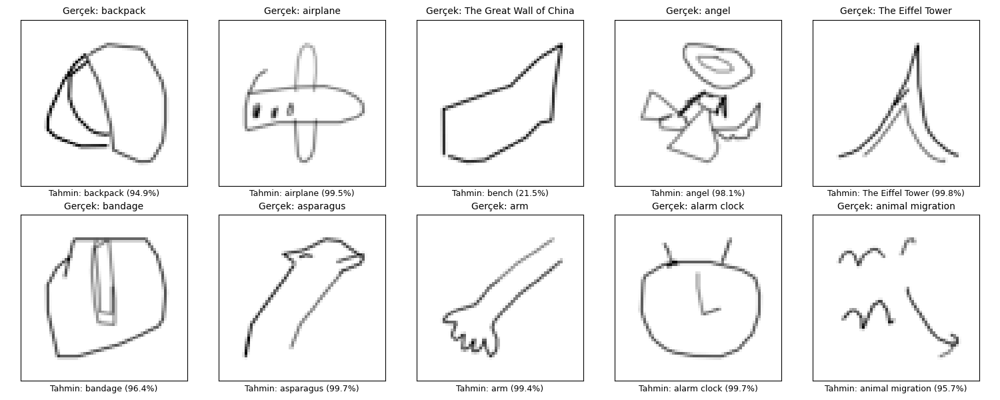
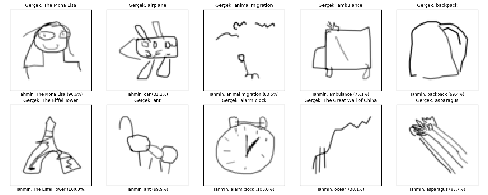
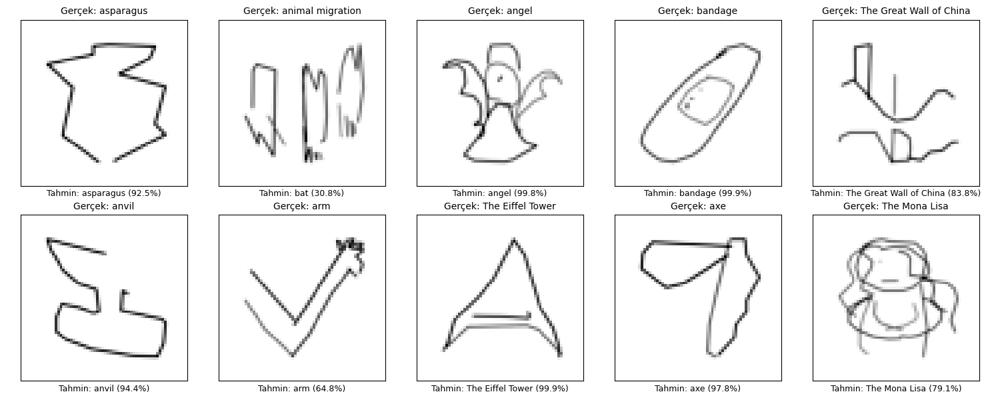
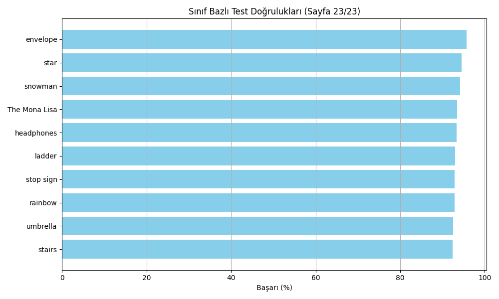
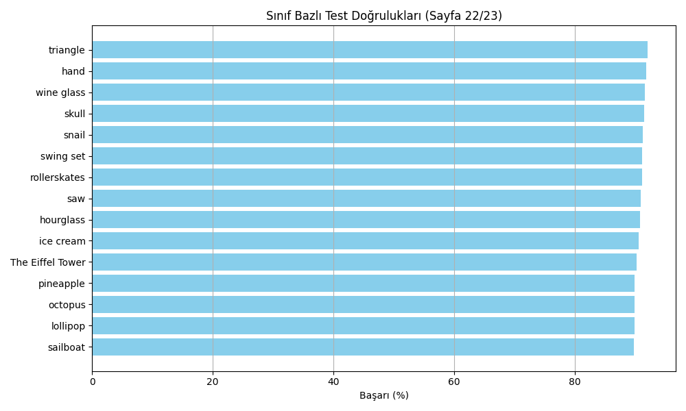
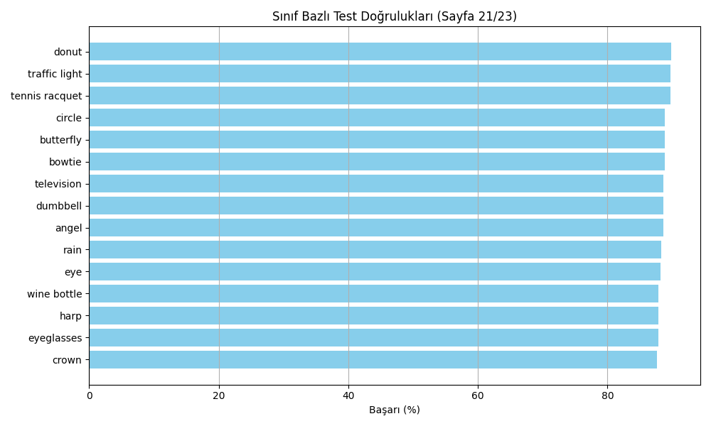

# Doodle Drawing Classifier

This project is a deep learning-based doodle classifier developed using Google's **Quick, Draw!** dataset. The model takes simple user-drawn sketches and predicts which category they belong to.

---

## Project Features

- Customized CNN architecture `DoodleCNN`  
- Capable of classifying 340 different classes  
- Training pipeline implemented in PyTorch  
- Supports training, testing, and inference modes  
- Generates random or balanced sample predictions after training  
- Visualizes per-class accuracy with bar charts  
- Saves best models as checkpoints with resume capability  

---

## Dataset Details

**Prepared Doodle Classifier Dataset**

This dataset is derived from Google’s **Quick, Draw!** dataset, containing over 1 million images spanning 340 different doodle categories. The images are grayscale and preprocessed for machine learning tasks.

- **Images:** 255x255 pixel grayscale doodle sketches  
- **Classes:** 340 distinct doodle categories, each in separate folders  
- **Total Images:** Approximately 1,020,000 with exactly 3,000 images per class  
- **Folder Structure:**  
  - A `doodle` folder containing 340 subfolders, each representing a class with 3,000 images  
  - A `master_doodle_dataframe.csv` file with metadata such as:  
    - `countrycode`: Country code of the user who drew the sketch  
    - `drawing`: JSON format drawing data  
    - `key_id`: Unique ID for each doodle  
    - `recognized`: Whether the doodle was recognized (bool)  
    - `word`: Class label (e.g., "traffic light")  
    - `image_path`: File path to the image  

### Use Cases

- Training and evaluating image classification models  
- Researching and benchmarking doodle recognition algorithms  
- Serving as a clean, organized dataset for academic and research purposes  

---

## Model Performance

- **Training Accuracy:** 88%  
- **Test Accuracy:** 75.5%  
- **Epochs:** 25

> The model performs well on many classes. Most prediction errors arise from data issues explained below.

---

## Notes on Data Quality

The dataset comprises sketches from users worldwide, so accuracy may vary for some classes due to:

- **Labeling Errors:** For example, a user may label a simple line as "The Great Wall of China," but the model correctly predicts it as "line." Such cases cause label mismatches.  
- **Style and Quality Variation:** Sketches within the same class may vary greatly, making learning more challenging.  
- **Inter-class Similarities:** Classes like "circle" and "donut" or "hat" and "helmet" can appear visually similar.

Despite these challenges, the model generalizes well.

---

## Sample Predictions

Test images are randomly or class-balanced sampled and their prediction results are saved as visualizations:

- Prediction images are saved in the `results/` folder  
- Each image includes the model's predicted label and confidence score  
- Per-class accuracy bar charts are also generated and saved  

---

## Result Visualizations

The `results/` folder contains various graphs and example prediction images visualizing the model’s performance:

### Diverse Prediction Images  
Randomly selected doodles from different classes alongside model predictions.

  
  
  

### Per-Class Accuracy Graphs  
Bar charts showing test accuracy per class.

  
  
  

These visuals provide a concise summary of the training process and model performance, easily accessible in the `results/` directory.

---
